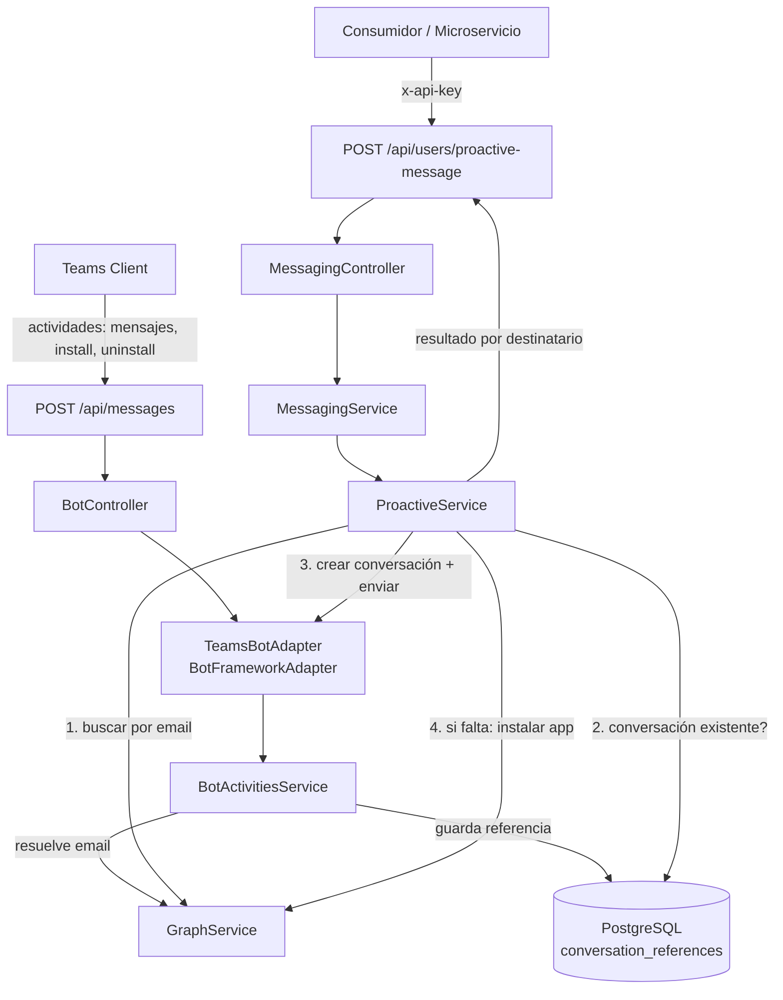
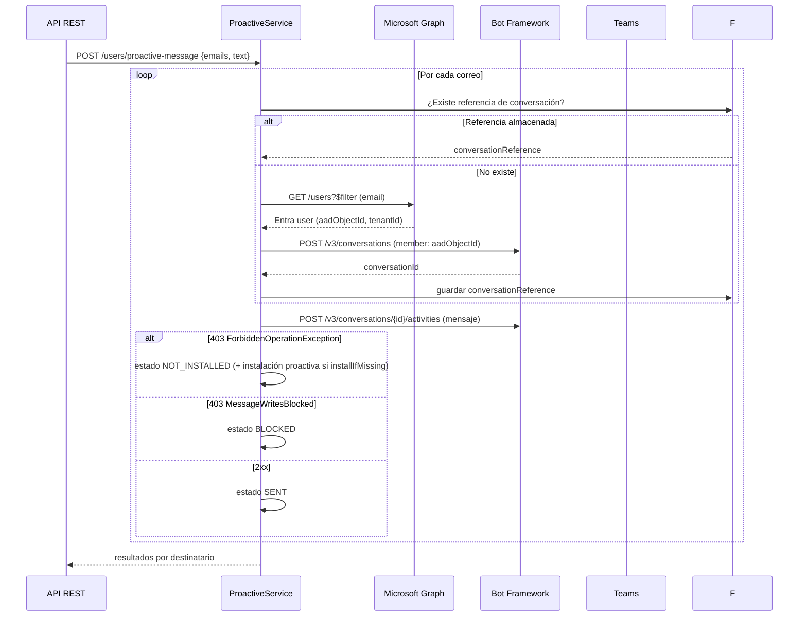

# Team Bot - Oberon 360

Bot de **Microsoft Teams** para el envío de **mensajes proactivos** (notificaciones, avisos y bienvenidas) a usuarios de la organización.

El bot expone una **API REST** donde solo necesitas escribir **un correo o una lista de correos**: el sistema resuelve cada correo en **Microsoft Entra ID**, crea la conversación con el usuario si hace falta, entrega el mensaje y te devuelve el estado de entrega de cada destinatario (enviado, no instalado, bloqueado, etc.).

> Basado en la documentación oficial de Microsoft sobre [mensajes proactivos](https://learn.microsoft.com/en-us/microsoftteams/platform/bots/how-to/conversations/send-proactive-messages). Ver [docs/MENSAJES_PROACTIVOS.md](docs/MENSAJES_PROACTIVOS.md) para la guía técnica completa.

---

## Tabla de contenidos

- [Características](#características)
- [Arquitectura](#arquitectura)
- [Cómo funciona el envío proactivo](#cómo-funciona-el-envío-proactivo)
- [Requisitos previos](#requisitos-previos)
  - [1. Registrar la aplicación en Microsoft Entra ID](#1-registrar-la-aplicación-en-microsoft-entra-id)
  - [2. Configurar el bot en Azure Bot Service](#2-configurar-el-bot-en-azure-bot-service)
  - [3. Empaquetar e instalar la aplicación de Teams](#3-empaquetar-e-instalar-la-aplicación-de-teams)
- [Variables de entorno](#variables-de-entorno)
- [Instalación y ejecución](#instalación-y-ejecución)
  - [Local (npm)](#local-npm)
  - [Docker](#docker)
- [API REST](#api-rest)
- [Estados de entrega](#estados-de-entrega)
- [Buenas prácticas implementadas](#buenas-prácticas-implementadas)
- [Pruebas](#pruebas)
- [Despliegue](#despliegue)
- [Solución de problemas](#solución-de-problemas)

---

## Características

- **Envío proactivo por correo**: envía un mensaje a un correo o a una lista de correos en una sola llamada.
- **Búsqueda de usuarios**: busca usuarios en Entra ID por correo, UPN o nombre, e indica si el bot puede enviarles mensajes en este momento.
- **Instalación proactiva**: con la opción `installIfMissing`, si el bot no está instalado para un usuario, se instala vía Microsoft Graph y se reintenta el envío.
- **Persistencia de conversaciones**: almacena las referencias de conversación en PostgreSQL para reutilizarlas (no se recrea la conversación en cada envío).
- **Detección de bloqueos**: distingue entre usuario que no tiene el bot instalado (`NOT_INSTALLED`), usuario que bloqueó/silenció el bot (`BLOCKED`) y otros errores.
- **Opt-out nativo**: los usuarios pueden escribir `optout` en el chat para dejar de recibir notificaciones proactivas (buena práctica recomendada por Microsoft).
- **Manejo de instalación/desinstalación**: guarda la referencia de conversación al instalar y la elimina al desinstalar.
- **API protegida**: las rutas REST requieren la API key (`x-api-key`).
- **Documentación Swagger** automática en `/api/docs`.
- **Arquitectura hexagonal ligera**: dominio, infraestructura, módulos y capas comunes separadas, consistente con el ecosistema Oberon 360.

---

## Arquitectura



### Estructura del proyecto

```
team-bot/
├── manifest/                    # Manifest de la aplicación de Teams + íconos
├── scripts/
│   └── generate-icons.mjs       # Genera los íconos placeholder del manifest
├── docs/
│   └── MENSAJES_PROACTIVOS.md   # Guía técnica del flujo proactivo (Microsoft)
├── src/
│   ├── main.ts                  # Bootstrap: helmet, CORS, pipes, Swagger
│   ├── app.module.ts            # Módulo raíz
│   ├── common/                  # Constantes, DTOs, filtros, guards, interceptors, tipos
│   ├── config/                  # Validación de entorno (Joi) + configuración TypeORM
│   ├── domain/                  # Entidades y puertos (interfaces de repositorio)
│   │   └── conversations/
│   ├── infrastructure/          # Implementaciones de repositorios (TypeORM)
│   │   └── conversations/
│   ├── modules/
│   │   ├── health/              # GET /api/health
│   │   ├── bot/                 # Endpoint del bot + manejo de actividades
│   │   ├── graph/               # Cliente de Microsoft Graph
│   │   ├── proactive/           # Servicio de envío proactivo
│   │   └── messaging/           # API REST (búsqueda y envío)
│   └── shared/                  # Servicios compartidos (MSAL)
└── test/
```

---

## Cómo funciona el envío proactivo

**Teams no permite enviar mensajes proactivos usando el correo o el UPN directamente.** Por eso el flujo es:



Los puntos clave de la documentación de Microsoft aplicados:

1. **Resolver el usuario**: el correo se convierte en el **AAD Object ID** (`aadObjectId`) mediante Microsoft Graph.
2. **Crear la conversación**: se hace **una sola vez** y se guarda el `conversationId` (con referencia de conversación persistida).
3. **Enviar el mensaje**: se usa el `conversationId` + `serviceUrl` almacenados.
4. **El bot debe estar instalado**: si no lo está, Teams devuelve `403 ForbiddenOperationException`; en ese caso el estado es `NOT_INSTALLED` y se puede activar la instalación proactiva vía Graph.

---

## Requisitos previos

### 1. Registrar la aplicación en Microsoft Entra ID

1. Entra a [Azure Portal](https://portal.azure.com) → **Microsoft Entra ID** → **App registrations** → **New registration**.
2. Nombre: `Oberon360 Team Bot`. En *Supported account types* elige tu escenario (recomendado: *Accounts in this organizational directory*).
3. En **Certificates & secrets** crea un **client secret** y guárdalo: será `MICROSOFT_APP_PASSWORD` (y `GRAPH_CLIENT_SECRET` si no usas un registro separado).
4. Anota el **Application (client) ID** y el **Directory (tenant) ID**: serán `MICROSOFT_APP_ID` y `MICROSOFT_APP_TENANT_ID` / `GRAPH_TENANT_ID`.

**Permisos de Microsoft Graph** (API permissions → Add permission → Microsoft Graph → Application permissions):

| Permiso | Uso |
| --- | --- |
| `User.Read.All` | Buscar y resolver usuarios por correo/UPN. |
| `TeamsAppInstallation.ReadForUser.All` | Consultar si la app está instalada para un usuario. |
| `TeamsAppInstallation.ReadWriteSelfForUser.All` | Instalación proactiva de la app (opción `installIfMissing`). |

> **Importante**: después de agregar los permisos debes dar **consentimiento de administrador** (*Grant admin consent*) en la misma hoja.

### 2. Configurar el bot en Azure Bot Service

1. En Azure Portal crea un recurso **Azure Bot** (o usa el canal de Bot Framework directo).
2. En **Configuration**, usa el mismo `MICROSOFT_APP_ID` (o crea uno nuevo y actualiza el `.env`).
3. Configura el **Messaging endpoint** con la URL de tu servicio: `https://<tu-host>/api/messages`.
4. Añade el canal **Microsoft Teams** desde *Channels*.

### 3. Empaquetar e instalar la aplicación de Teams

1. Ejecuta `npm run icons` para generar los íconos placeholder del manifest.
2. Edita `manifest/manifest.json`:
   - `bots[0].botId` → tu `MICROSOFT_APP_ID`.
   - El campo `id` del manifest debe coincidir con la variable `MANIFEST_APP_ID` del entorno (es el `externalId` que Graph usa para verificar la instalación).
3. Comprime el contenido de `manifest/` en un ZIP (los tres archivos en la raíz del ZIP).
4. En Teams: **Apps → Upload a custom app** (o publica en el catálogo organizacional con `TeamsAppInstallation.ReadWriteSelfForUser.All`).

---

## Variables de entorno

Copia `.env.example` a `.env` y completa los valores:

| Variable | Requerida | Descripción |
| --- | --- | --- |
| `MICROSOFT_APP_ID` | ✅ | Application (client) ID del bot. |
| `MICROSOFT_APP_PASSWORD` | ✅ | Client secret del bot. |
| `MICROSOFT_APP_TENANT_ID` | | Tenant ID (recomendado para single-tenant). |
| `MICROSOFT_APP_NAME` | | Nombre público del bot. |
| `BOT_FRAMEWORK_OAUTH_SCOPE` | | Alcance OAuth del bot hacia el canal para mensajes proactivos (por defecto `https://api.botframework.com`). |
| `TEAMS_SERVICE_URL` | | URL global de servicio de Teams para mensajes proactivos (por defecto `https://smba.trafficmanager.net/teams/`). |
| `GRAPH_TENANT_ID` / `GRAPH_CLIENT_ID` / `GRAPH_CLIENT_SECRET` | | Credenciales Graph separadas. Si se dejan vacías se usan las del bot. |
| `MANIFEST_APP_ID` | ✅ | GUID del manifest de la app de Teams. |
| `TEAMS_APP_CATALOG_ID` | | ID de catálogo de la app (se resuelve solo vía Graph). |
| `API_KEY` | | Clave del header `x-api-key` para la API REST. Vacía = API abierta (solo desarrollo). |
| `DB_HOST`, `DB_PORT`, `DB_USER`, `DB_PASSWORD`, `DB_NAME` | | Conexión PostgreSQL. |
| `DB_SYNCHRONIZE` | | `true` en desarrollo (crea el esquema). `false` en producción. |
| `DB_SSL` | | `true` si la BD exige SSL (Azure). |
| `PORT` | | Puerto HTTP (3000 por defecto). |
| `NODE_ENV` | | `development` / `test` / `production`. |

---

## Instalación y ejecución

### Local (npm)

```bash
# 1. Base de datos (PostgreSQL)
docker compose up -d postgres

# 2. Dependencias
npm install

# 3. Configuración
cp .env.example .env   # completa los valores

# 4. Ejecutar
npm run start:dev
```

La aplicación queda disponible en:

- API: `http://localhost:3000/api`
- Swagger: `http://localhost:3000/api/docs`
- Endpoint del bot: `http://localhost:3000/api/messages`

### Docker

```bash
cp .env.example .env
docker compose up --build
```

---

## API REST

Todas las respuestas usan el envelope:

```json
{ "success": true, "data": { }, "timestamp": "2026-08-18T12:00:00.000Z" }
```

Los errores devuelven `success: false` con `statusCode` y `message`.

### `GET /api/health`

Verificación de vida del servicio. **No requiere API key.**

### `GET /api/users/search?q=juan`

Busca usuarios en Entra ID (coincide con el inicio del correo, UPN o nombre).

```bash
curl -H "x-api-key: tu-clave" "http://localhost:3000/api/users/search?q=juan"
```

Respuesta (por usuario):

```json
{
  "id": "00000000-0000-0000-0000-000000000001",
  "displayName": "Juan Pérez",
  "mail": "juan.perez@empresa.com",
  "userPrincipalName": "juan.perez@empresa.com",
  "jobTitle": "Analista",
  "hasConversation": true,
  "botInstalled": true,
  "canReceiveProactiveMessages": true
}
```

`canReceiveProactiveMessages` te dice **a quién puede enviar el bot** ahora mismo.

### `POST /api/users/proactive-message`

Envía un mensaje a **un correo o una lista de correos**.

```bash
curl -X POST -H "x-api-key: tu-clave" -H "Content-Type: application/json" \
  "http://localhost:3000/api/users/proactive-message" \
  -d '{
    "emails": ["juan.perez@empresa.com", "maria.gomez@empresa.com"],
    "text": "Hola, este es un aviso importante de Oberon 360.",
    "installIfMissing": true
  }'
```

Respuesta:

```json
{
  "total": 2,
  "sent": 1,
  "failed": 1,
  "results": [
    {
      "email": "juan.perez@empresa.com",
      "status": "SENT",
      "aadObjectId": "00000000-0000-0000-0000-000000000001",
      "conversationId": "a:1qhNLqp...",
      "activityId": "1672..."
    },
    {
      "email": "maria.gomez@empresa.com",
      "status": "NOT_INSTALLED",
      "message": "El bot no está instalado para este usuario en el ámbito personal. Instala la aplicación o usa la opción installIfMissing.",
      "aadObjectId": "00000000-0000-0000-0000-000000000002"
    }
  ]
}
```

### `GET /api/conversations`

Lista las referencias de conversación almacenadas (usuarios con el bot instalado). Útil para administración.

---

## Estados de entrega

| Estado | Significado |
| --- | --- |
| `SENT` | Mensaje entregado. |
| `USER_NOT_FOUND` | El correo no corresponde a ningún usuario de Entra ID. |
| `NOT_INSTALLED` | El bot no está instalado para el usuario (403 `ForbiddenOperationException`). |
| `BLOCKED` | El usuario bloqueó, silenció o desinstaló el bot (403 `MessageWritesBlocked`). |
| `OPTED_OUT` | El usuario escribió `optout` y no recibe notificaciones proactivas. |
| `ERROR` | Error inesperado durante la entrega. |

---

## Buenas prácticas implementadas

Siguiendo la [guía de mejores prácticas de mensajes proactivos de Microsoft](https://learn.microsoft.com/en-us/microsoftteams/platform/bots/how-to/conversations/send-proactive-messages):

- ✅ **Mensaje de bienvenida claro**: explica por qué el usuario recibe el mensaje y qué puede hacer.
- ✅ **Ruta de opt-out**: comando `optout` para dejar de recibir notificaciones.
- ✅ **Reutilización de conversaciones**: la conversación se crea una sola vez y se almacena.
- ✅ **Manejo de `ForbiddenOperationException`**: distingue "no instalado" y permite la instalación proactiva.
- ✅ **Detección de `MessageWritesBlocked`**: reporta usuarios que bloquearon/silenciaron el bot.
- ✅ **No usar correo/UPN para enviar**: siempre se resuelve el AAD Object ID vía Graph.
- ✅ **Mensajes de notificación accionables**: el contenido es libre pero se recomienda indicar qué pasó y qué puede hacer el usuario.

---

## Pruebas

```bash
npm test          # pruebas unitarias (jest)
npm run test:cov  # cobertura
npm run lint      # eslint + prettier
```

Las pruebas unitarias cubren el clasificador de errores proactivos y el flujo de entrega
(enviado, usuario no encontrado, opt-out, no instalado con y sin reinstalación, bloqueado, error).

---

## Despliegue

El servicio está dockerizado (`Dockerfile`) y listo para Azure Container Apps (como el resto del ecosistema Oberon 360):

```bash
docker build -t registry.example.com/team-bot:1.0.0 .
docker push registry.example.com/team-bot:1.0.0
```

Consideraciones de producción:

- `DB_SYNCHRONIZE=false` y gestionar el esquema con migraciones.
- Definir `API_KEY` fuerte.
- `NODE_ENV=production`.
- Configurar el **Messaging endpoint** de Azure Bot con `https://<tu-host>/api/messages`.

---

## Solución de problemas

| Problema | Causa probable | Solución |
| --- | --- | --- |
| `403 ForbiddenOperationException` | La app no está instalada para el usuario en ámbito personal. | Instala la app o usa `installIfMissing: true`. |
| `403 MessageWritesBlocked` | El usuario bloqueó/silenció/desinstaló el bot. | Informar al usuario o esperar a que reinstale. |
| `401` al llamar a Graph | Secret o permisos incorrectos / sin consentimiento de administrador. | Verificar `MICROSOFT_APP_PASSWORD` y los permisos con *Grant admin consent*. |
| `400` al crear la conversación | Tenant incorrecto o usuario fuera del tenant. | Verificar `GRAPH_TENANT_ID` / `MICROSOFT_APP_TENANT_ID`. |
| El bot no responde | Messaging endpoint mal configurado. | Verificar que el endpoint apunte a `/api/messages`. |
| Swagger no carga | Política CSP del navegador. | Helmet ya está configurado para permitirlo; si usas un proxy, verifica sus headers. |
